## 📌 About Me
- CSE undergrad at NIE Mysore, passionate about open source, AI/ML, and Python development. I thrive on building impactful tech projects from contributing to GitHub and IEEE to experimenting with multimodal AI using Vertex and Gemini and i'm also Google Student Ambassador

## 🧠 My Focus Areas
- Web Development
- Open Source
- AI/ML

## 📊 GitHub Stats & Trophies

  
  

  

  

## 🛠️ Languages & Tools

<h3 align="center">Programming Languages</h3>

  

<h3 align="center">Frontend</h3>

  

<h3 align="center">DevOps & Cloud</h3>

  &nbsp;&nbsp;
  

<h3 align="center">Tools</h3>

  &nbsp;&nbsp;
  &nbsp;&nbsp;
  &nbsp;&nbsp;
  

  

 

## 🔗 Connect with Me

  

  

  

